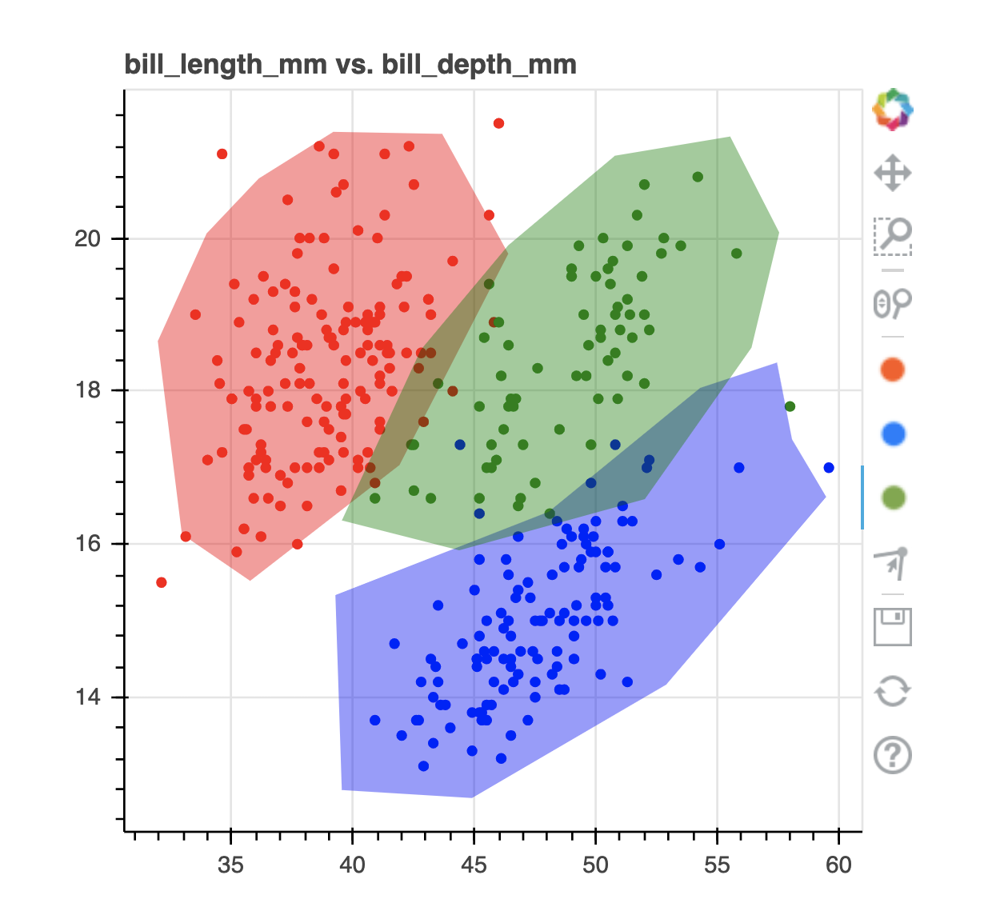

# Summary

This package contains scikit-learn compatible tools that make it easier to construct and benchmark rule based systems that are designed by humans. There's tools to turn python functions into scikit-learn compatible components as well as interactive jupyter widgets that allow the user to draw models. It can also be used to design rules on top of existing models that, for example, can trigger a classifier fallback when outliers are detected.

# Statement of need

There's been a transition from rule-based systems to ones that use machine-learning. Initially, systems were written to take data and to apply rules to them to output labels.

Recently, it's become much more fashionable to take data with labels and to use machine-learning algorithms to figure out appropriate rules.

We started wondering if we might have lost something in this transition. Machine learning can be generally applied but it is also capable of making bad decision that are very hard to debug.  Tools like SHAP (@NIPS2017_7062) and LIME (@lime) try to explain why algorithms make certain decisions in hindsight, but even with the benefit of hindsight it's very hard to truly understand what is happening.

At the same time, it's also true that many classification problems can be handled by natural intelligence too. The goal of this package is to make it easier to turn the act of exploratory data analysis into a well understood model. These "human" models are very explainable from the start. If nothing else, they can serve as a simple benchmark that represents domain knowledge which is a great starting point for any predictive project.

The library features components to easily turn python functions into scikit-learn compatible components (@sklearn_api). Both the `FunctionClassifier` and the `FunctionRegressor` can turn python functions into grid-searchable components. Human-learn also host a suite of interactive widgets, made with Bokeh (@bokeh), that might help construct models from Jupyter (@jupyter) as well.

The above screenshot demonstrates the `InteractiveChart` interface that can be used to draw machine learning models. Note that the same UI can also be used for outlier detection, labelling tasks or general data exploration as well.

# Acknowledgements

This project was developed in my spare time while being employed at Rasa. They have been very supportive of me working on my own projects on the side and I would like to recognise them for being a great employer.

I also want to acknowledge that I'm building on the shoulders of giants. The popular drawing widget in this library would not have been possible without the wider bokeh, jupyter and ipywidgets communities.

There have been also been small contributions on Github from Joshua Adelman, Kay Hoogland and Gabriel Luiz Freitas Almeida.

# References
